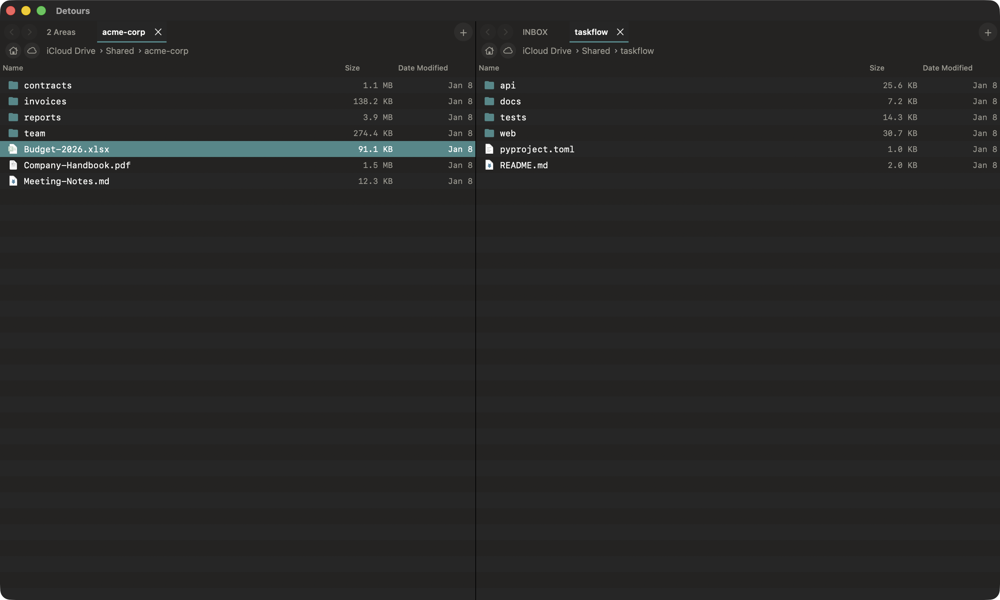

# Detours User Guide

A fast, keyboard-driven file manager for macOS with dual-pane layout.

---

## Interface Overview

Detours shows two file panes side-by-side, each with independent tabs. One pane is always "active" (indicated by the accent-colored tab underline). The active pane receives keyboard input.

### Panes

- **Switch pane**: Press `Tab` (without modifiers)
- **Active pane**: Has accent-colored underline on selected tab
- **Inactive pane**: Has gray underline, no selection highlight shown

### Tabs

Each pane can have multiple tabs, each showing a different directory:

| Action | Shortcut |
|--------|----------|
| New tab | Cmd-T |
| Close tab | Cmd-W |
| Next tab | Ctrl-Tab |
| Previous tab | Ctrl-Shift-Tab |
| Select tab 1-9 | Cmd-1 through Cmd-9 |
| Open folder in new tab | Cmd-Shift-Down |

Tabs can be reordered by dragging, and moved between panes by dragging to the other pane's tab bar.

### Path Bar

Below the tabs, the path bar shows:
- **Back/Forward buttons**: Navigate history
- **Home button**: Go to home directory
- **iCloud button**: Go to iCloud Drive
- **Path**: Click any segment to navigate

**Path bar tips:**
- Click a segment to navigate there
- Drag a segment to terminal or another app to insert the path
- Right-click a segment to copy its path

### Status Bar

At the bottom of each pane (toggle with View menu):
- Item count and selection count
- Size of selected items
- Hidden file count (if any hidden)
- Available disk space

### Sidebar

The sidebar shows mounted volumes, network shares, and favorite folders:

| Action | How |
|--------|-----|
| Navigate to item | Click it |
| Add favorite | Drag folder from file list |
| Reorder favorites | Drag to new position |
| Remove favorite | Right-click → Remove from Favorites |
| Eject volume | Right-click → Eject, or click eject button |
| Connect to server | Right-click network section → Connect to Share (Cmd-K) |
| Toggle sidebar | Cmd-0 |

**Network shares:** The sidebar has a dedicated NETWORK section showing servers discovered via Bonjour. Servers group their mounted volumes underneath. Offline servers appear dimmed. Use Cmd-K to connect to a server manually (SMB/AFP).

---

## Navigation

### Keyboard Navigation

| Action | Shortcut |
|--------|----------|
| Move selection | Arrow keys |
| Open file/folder | Enter or Cmd-O |
| Go to parent folder | Cmd-Up |
| Go back | Cmd-Left |
| Go forward | Cmd-Right |
| Type-to-select | Start typing filename |
| Refresh | Cmd-R |

### Quick Open (Cmd-P)

Quick Open searches your entire disk using Spotlight:

1. Press **Cmd-P** to open
2. Type to search (substring matching)
3. Press **Enter** to navigate to selected folder
4. Press **Cmd-Enter** to reveal file's enclosing folder

Results are ranked by "frecency" - frequently and recently visited directories appear first (marked with a star).

**Tip:** Quick Open searches Documents, Downloads, Desktop, dev folders, and iCloud Drive. Enable "Include hidden files in Quick Open" in Preferences to also search hidden files.

### Selection

| Action | Shortcut |
|--------|----------|
| Select item | Click or arrow keys |
| Extend selection | Shift-Up/Down |
| Select all | Cmd-A |
| Clear multi-selection | Click empty space |

---

## File Operations

### Basic Operations

| Action | Shortcut |
|--------|----------|
| Copy | Cmd-C |
| Cut | Cmd-X |
| Paste | Cmd-V |
| Duplicate | Cmd-D |
| Duplicate Structure | Right-click folder → Duplicate Structure... |
| Rename | F2 or Shift-Enter |
| Move to Trash | Cmd-Delete or F8 |
| Delete Immediately | Cmd-Option-Delete |
| New Folder | Cmd-Shift-N or F7 |
| New Text File | Cmd-Option-N |

**Duplicate Structure** creates a copy of a folder's entire directory hierarchy without copying files. Ideal for year-based folder templates (e.g., `Clients/2025/` → `Clients/2026/`). Auto-detects years in folder names and offers to substitute them.

### Cross-Pane Operations

Move or copy files directly to the other pane:

| Action | Shortcut |
|--------|----------|
| Copy to other pane | F5 |
| Move to other pane | F6 |

After the operation, the moved/copied files are automatically selected in the destination pane.

### Other Actions

| Action | Shortcut |
|--------|----------|
| Quick Look preview | Space |
| Get Info | Cmd-I |
| Copy Path | Cmd-Option-C |
| Open in Editor | F4 (opens in TextEdit) |
| Reveal in Finder | File menu → Reveal in Finder |
| Show Package Contents | File menu (for .app bundles etc.) |

### Archives

Create and extract archives directly from the file list.

| Action | Shortcut |
|--------|----------|
| Archive selected items | Cmd-Shift-A |
| Extract archive | Cmd-Shift-E or double-click |

**Creating archives:**
- Select files/folders, then File > Archive... (or right-click > Archive...)
- Five formats: ZIP, 7Z, TAR.GZ, TAR.BZ2, TAR.XZ
- ZIP and 7Z support optional password encryption
- Formats requiring external tools (7z, xz, bzip2) are shown dimmed if not installed
- Last-used format is remembered between sessions

**Extracting archives:**
- Select an archive, then File > Extract Here (or right-click > Extract Here, or double-click)
- Password-protected archives prompt for password
- Conflict dialog when extracting over existing items (Skip/Replace/Keep Both)

### Share

Share files via AirDrop and other system sharing services:

- File > Share (or right-click > Share)
- AirDrop is listed first for quick access
- Available sharing services depend on the selected file types

### Disk Images

Opening `.dmg`, `.sparsebundle`, `.sparseimage`, or `.iso` files (via Cmd-P, double-click, or Enter) mounts them and navigates the pane to the mounted volume. For encrypted disk images, the pane navigates after the password dialog completes.

### Conflict Resolution

When pasting files that already exist at the destination, a dialog offers:
- **Skip**: Don't copy this file
- **Replace**: Overwrite existing file
- **Keep Both**: Rename the new file (adds number suffix)

### Undo and Redo

Most file operations can be undone with **Cmd-Z** and redone with **Cmd-Shift-Z**:

- Undo delete (restores from Trash), copy, move, duplicate, rename, and new folder/file
- Each tab has its own independent undo history
- Edit menu shows the operation name (e.g., "Undo Delete", "Undo Move")
- Delete Immediately cannot be undone

### Delete Immediately

**Cmd-Option-Delete** permanently deletes files without using the Trash. A confirmation dialog appears:

> "filename" will be deleted immediately. You can't undo this action.

Use with caution - this bypasses the Trash completely.

---

## Filter-in-Place

Press `/` or `Cmd-F` to filter the current file list without leaving the directory.

- Case-insensitive substring matching filters in real-time as you type
- Auto-expands folders to reveal matching nested files
- Match count shows visible items (e.g., "12 of 347")
- Escape clears filter text; second press closes the filter bar
- Down arrow moves focus from filter field to file list

---

## Folder Expansion

Folders can be expanded inline to show their contents without navigating into them (like Finder's list view).

### Mouse

- Click the disclosure triangle (▶) to expand/collapse
- **Option-click** to expand/collapse recursively (all nested folders)

### Keyboard

| Action | Shortcut |
|--------|----------|
| Expand folder | Right Arrow (when folder selected) |
| Collapse folder | Left Arrow (when expanded folder selected) |
| Move to first child | Right Arrow (when already expanded) |
| Move to parent | Left Arrow (when collapsed or on child item) |
| Expand recursively | Option-Right |
| Collapse recursively | Option-Left |

### Behavior

- Expansion state is preserved per tab
- Expansion state persists across app restarts
- When collapsing a folder, if selection was inside it, selection moves to the folder
- Each pane's tabs have independent expansion states

### Disabling

To disable folder expansion (removes disclosure triangles):
Preferences → General → uncheck "Enable folder expansion"

---

## Git Status Indicators

When viewing a Git repository, files show colored status bars in the left gutter:

| Color | Status |
|-------|--------|
| Amber | Modified (changed since last commit) |
| Green | Staged (added to index) |
| Gray | Untracked (new file, not in git) |
| Red | Conflict (merge conflict) |

Git status indicators work for files inside expanded folders too.

### Configuration

Preferences → Git:
- Toggle git status indicators on/off
- Preview status colors

---

## Themes and Appearance

### Built-in Themes

Preferences → Appearance offers four themes:
- **Light**: Light background, dark text
- **Dark**: Dark background, light text
- **Foolscap**: Warm cream background, Courier font
- **Drafting**: Cool blue-gray background, Menlo font

Select **System** to automatically follow macOS dark/light mode.

### Custom Theme

Select "Custom" to create your own theme with:
- 8 customizable colors (background, surface, border, text colors, accent)
- Font selection (SF Mono, Menlo, Courier, or proportional fonts like SF Pro)
- Font size (10-16px)

### Date Formats

Customize how dates appear in the file list:
- **Current year format**: e.g., "d. MMM H:mm" → "21. Jan 14:30"
- **Other years format**: e.g., "d.M.yy" → "21.1.25"

Uses standard date format patterns (see Apple's date formatting guide).

---

## Preferences

Open with **Cmd-,** (or Detours menu → Preferences)

### General

- **Restore session on launch**: Reopen tabs from last session
- **Show hidden files by default**: New tabs show hidden files
- **Include hidden files in Quick Open**: Search includes hidden files
- **Enable folder expansion**: Show disclosure triangles

### Appearance

- Theme selection
- Custom theme editor
- Font size
- Date format customization

### Shortcuts

Customize keyboard shortcuts for 13 actions:
- Quick Look, Open in Editor
- Copy/Move to Other Pane
- New Folder, Delete, Rename
- Open in New Tab
- Toggle Hidden Files
- Quick Open, Refresh, Toggle Sidebar

Click a shortcut field and press your desired key combination. Click the reset button (↺) to restore the default.

### Git

- Enable/disable git status indicators

---

## Hidden Features

Features that aren't immediately obvious:

### Split Pane Divider

- **Drag** the divider between panes to resize
- **Snap to center**: Divider snaps to equal width when dragged within 12px of center

### iCloud Drive

- iCloud app folders show friendly names (e.g., "Pages" instead of "com~apple~Pages")
- Navigating into an iCloud app container automatically skips to its Documents subfolder
- iCloud root uses a Finder-like top-level list (Documents, Downloads, app folders, etc.)
- Top-level shared items are split into a dedicated `Shared` folder
- `Shared` shows one combined list for items shared to you and by you
- Shared labels show `Shared by <owner>` or `Shared by me`
- Hidden-files toggle applies to both iCloud root and `Shared` view

### Packages

- .app bundles, .sparsebundle, and other packages open on Enter (not navigate into)
- Use "Show Package Contents" to navigate inside a package

### Hidden Files

- Toggle hidden files for current tab: **Cmd-Shift-.**
- Hidden file count shown in status bar

### Session Persistence

With "Restore session" enabled:
- All tabs restore on launch
- Selection within each tab restores
- Active pane restores
- Folder expansion states restore
- Sidebar visibility restores

### Drag and Drop

- Drag files between panes to move them
- Drag files to Finder to copy
- Drag files to other apps (e.g., attach to email)
- Drop files from Mail attachments (and other apps using file promises) into panes
- Drag folders to sidebar to add as favorites
- Drag path bar segments to terminal to insert path

---

## Keyboard Shortcuts Reference

### Navigation

| Action | Shortcut |
|--------|----------|
| Quick Open | Cmd-P |
| Filter in place | / or Cmd-F |
| Go back | Cmd-Left |
| Go forward | Cmd-Right |
| Go to parent | Cmd-Up |
| Refresh | Cmd-R |
| Switch pane | Tab |
| Next tab | Ctrl-Tab |
| Previous tab | Ctrl-Shift-Tab |
| Select tab 1-9 | Cmd-1 through Cmd-9 |
| Connect to Share | Cmd-K |

### Files

| Action | Shortcut |
|--------|----------|
| Open | Enter or Cmd-O |
| Quick Look | Space |
| Open in Editor | F4 |
| Get Info | Cmd-I |
| Copy Path | Cmd-Option-C |
| Show Package Contents | (menu only) |
| Reveal in Finder | (menu only) |

### Editing

| Action | Shortcut |
|--------|----------|
| Cut | Cmd-X |
| Copy | Cmd-C |
| Paste | Cmd-V |
| Duplicate | Cmd-D |
| Rename | F2 or Shift-Enter |
| Move to Trash | Cmd-Delete or F8 |
| Delete Immediately | Cmd-Option-Delete |
| New Folder | Cmd-Shift-N or F7 |
| New Text File | Cmd-Option-N |
| Archive | Cmd-Shift-A |
| Extract Here | Cmd-Shift-E |
| Undo | Cmd-Z |
| Redo | Cmd-Shift-Z |

### Cross-Pane

| Action | Shortcut |
|--------|----------|
| Copy to other pane | F5 |
| Move to other pane | F6 |

### Folder Expansion

| Action | Shortcut |
|--------|----------|
| Expand folder | Right Arrow |
| Collapse folder | Left Arrow |
| Expand recursively | Option-Right |
| Collapse recursively | Option-Left |

### View

| Action | Shortcut |
|--------|----------|
| Toggle hidden files | Cmd-Shift-. |
| Toggle sidebar | Cmd-0 |
| Toggle status bar | (View menu) |
| New tab | Cmd-T |
| Close tab | Cmd-W |
| Close window | Cmd-Shift-W |
| Open in new tab | Cmd-Shift-Down |

### App

| Action | Shortcut |
|--------|----------|
| Preferences | Cmd-, |
| Quit | Cmd-Q |
| Minimize | Cmd-M |

---

## Requirements

- macOS 14.0 (Sonoma) or later
- Apple Silicon or Intel Mac
